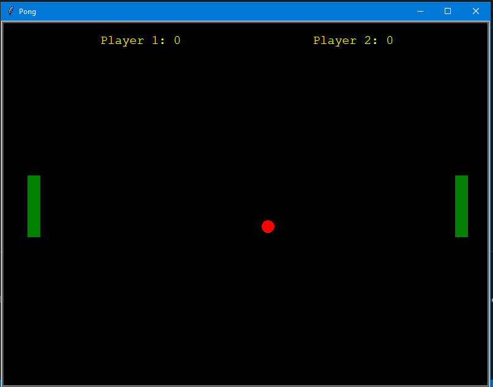
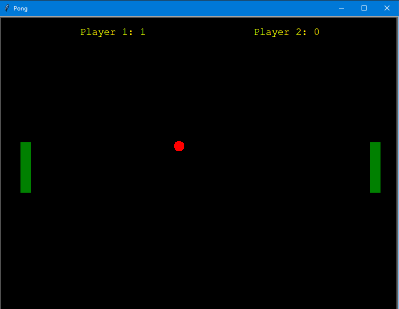

#PING_PONG 
It is a multiplayer Ping-Pong game which is written in python. Here turtle module is used which provides turtle graphics primitives. Sound files are also included for better experience. If you want to run this game, just import all the files in your system and have fun. 

### GAME WINDOW
 

### SCORE

## CONTROLS

### FOR PLAYER 1:

	To move paddle up press 'u'
	To move paddle down press 'd'

### FOR PLAYER 2:

	To move paddle up press '↑'
	To move paddle down press '↓'

## DEPENDENCIES

1.Python v3.x is required.
2.turtle module is also required.